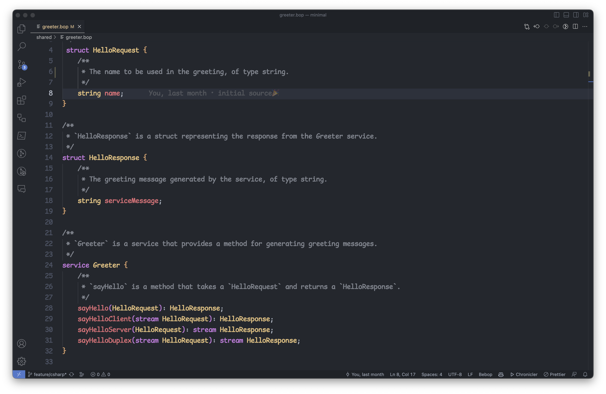

<h1 align="center">
Bebop for Visual Studio Code
</h1>

  

Boost your productivity with Bebop for Visual Studio Code - a comprehensive extension that integrates the Bebop schema language into your beloved editor. Our extension facilitates a seamless coding experience with syntax highlighting, code refactoring, auto-completion, and a plethora of handy snippets that will speed up your Bebop coding across various projects. 

To dive deeper into Bebop, please visit the [Bebop documentation](https://bebop.sh).

Our extension is compatible with **Windows**, **macOS**, and **Linux** and supports both x86 and ARM architectures.

## Getting Started
1. Install the Bebop for Visual Studio Code extension from the Visual Studio Marketplace.
2. Follow the instructions on the [Bebop documentation](https://github.com/betwixt-labs/bebop/wiki#getting-started) to set up your project with Bebop, customized for your target language.

## Features
- Dedicated Bebop Language Server
- Bebop syntax highlighting
- Syntax validation for error minimization
- Snippets for efficient code production
- Auto-completion for streamlined coding
- Auto-formatting for neat and clean code
- Refactoring options for optimized code
- Quick commenting functionality
- Many more features to explore

  

## Found a bug?
If you've encountered a problem, we appreciate your contribution in making Bebop better. Please file an issue on the [Bebop repository](https://github.com/betwixt-labs/bebop).